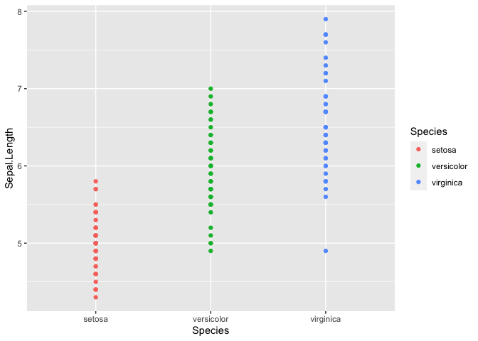

In this post, we will be analyzing data as if we were looking at it for
the first time. This is called ‘Exploratory Data Analysis’. We will
gather insights from the `iris` dataset. First, let’s load up the data
and have a brief look at it. Usinig `class`, we can see that the dataset
is a `data.frame`.

    data(iris)
    class(iris)

    ## [1] "data.frame"

Using `head`, we can take a look at the first 5 rows. This may be
helpful when analyzing large datasets.

    head(iris)

    ##   Sepal.Length Sepal.Width Petal.Length Petal.Width Species
    ## 1          5.1         3.5          1.4         0.2  setosa
    ## 2          4.9         3.0          1.4         0.2  setosa
    ## 3          4.7         3.2          1.3         0.2  setosa
    ## 4          4.6         3.1          1.5         0.2  setosa
    ## 5          5.0         3.6          1.4         0.2  setosa
    ## 6          5.4         3.9          1.7         0.4  setosa

We can see there are 4 columns that are made up of numbers and one with
strings. The fifth column `Species` suggests that each row corresponds
to a data from a single sample of that species. We can also use `dim` to
find the full dimensions of the data.

    dim(iris)

    ## [1] 150   5

This gives us 150 rows and 5 columns. It is also good practice to use
the `str` function to briefly look at the structure of the data.

    str(iris)

    ## 'data.frame':    150 obs. of  5 variables:
    ##  $ Sepal.Length: num  5.1 4.9 4.7 4.6 5 5.4 4.6 5 4.4 4.9 ...
    ##  $ Sepal.Width : num  3.5 3 3.2 3.1 3.6 3.9 3.4 3.4 2.9 3.1 ...
    ##  $ Petal.Length: num  1.4 1.4 1.3 1.5 1.4 1.7 1.4 1.5 1.4 1.5 ...
    ##  $ Petal.Width : num  0.2 0.2 0.2 0.2 0.2 0.4 0.3 0.2 0.2 0.1 ...
    ##  $ Species     : Factor w/ 3 levels "setosa","versicolor",..: 1 1 1 1 1 1 1 1 1 1 ...

Again, this confirmed our brief look earlier that there are 4 columns of
numbers. We can also see the fifth column is actually a `Factor` with 3
levels. Using `summmary`, we can acquire some insight on the data
distribution.

    summary(iris)

    ##   Sepal.Length    Sepal.Width     Petal.Length    Petal.Width   
    ##  Min.   :4.300   Min.   :2.000   Min.   :1.000   Min.   :0.100  
    ##  1st Qu.:5.100   1st Qu.:2.800   1st Qu.:1.600   1st Qu.:0.300  
    ##  Median :5.800   Median :3.000   Median :4.350   Median :1.300  
    ##  Mean   :5.843   Mean   :3.057   Mean   :3.758   Mean   :1.199  
    ##  3rd Qu.:6.400   3rd Qu.:3.300   3rd Qu.:5.100   3rd Qu.:1.800  
    ##  Max.   :7.900   Max.   :4.400   Max.   :6.900   Max.   :2.500  
    ##        Species  
    ##  setosa    :50  
    ##  versicolor:50  
    ##  virginica :50  
    ##                 
    ##                 
    ## 

We can start by using a boxplot looking at the distribution of
`Sepal.Length` between the three species. A boxplot summarises the data
with five numbers: - Minimum - First Quartile - Median - Third Quartile
- Maximum

    library(ggplot2)
    ggplot(iris, mapping = aes(y = Sepal.Length, x = Species, fill = Species)) + geom_boxplot()

